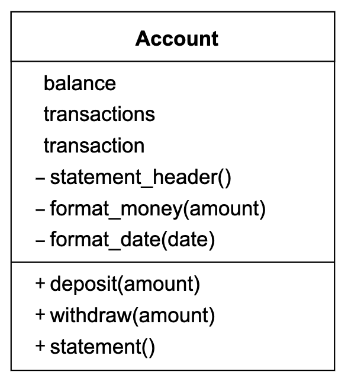

# 🏦 Bank tech test 🐖

This is my submission for the Bank tech test, completed as part of Makers Academy's tech test week. I chose to write the code in Ruby, using RSPEC to test drive my code. My code has 100% test coverage according to the SimpleCov gem. 

I started by extracting several user stories, which I used to a class diagram. I initially completed the exercise using only one class, but I later extracted functionality to a transaction class and a statement class, which is visualied in the class diagrams below. 

## User Stories

    As a user
    So that I can keep my money safe
    I would like to be able to deposit money in my bank account.
    
    As a user
    So that I can spend my money
    I would like to be able to withdraw money from my bank account.

    As a user
    So that I can keep tabs on my money
    I would like to be able to view a bank statement.
    
    As a user
    So that I can keep tabs on my money
    I would like to be able to see transaction dates on my bank statements.
    
    As a user
    So that I can keep tabs on my money
    I would like to be able to see transaction amounts on my bank statements.
    
    As a user
    So that I can keep tabs on my money
    I would like to be able to see my current balance on my bank statement.

## Class Diagrams

### Setup and Code Example:
Setup:
Fork this repository 

Clone the repository and follow below:

      > bundle install
      > rspec

      > cd lib
      > irb

       $ irb

       2.7.0 :001 > require './account.rb'
         => true 

       2.7.0 :002 > a = Account.new
         => #<Account:0x00007f9b87b5a160 @balance=0, @transactions=[],  @transaction=Transaction> 

       2.7.0 :003 > a.deposit(1000)
          => [#<Transaction:0x00007f9b8a1f6788 @date="12/01/2021", @credit=nil, @debit="1000.00", @balance="1000.00">] 

       2.7.0 :004 > a.withdraw(160)
         => [#<Transaction:0x00007f9b87b13300 @date="12/01/2021", @credit="160.00", @debit=nil, @balance="840.00">, #<Transaction:0x00007f9b8a1f6788 @date="12/01/2021", @credit=nil, @debit="1000.00", @balance="1000.00">] 

       2.7.0 :005 > a.statement
         date || credit || debit || balance
         12/01/2021 || 160.00 ||  || 840.00
         12/01/2021 ||  || 1000.00 || 1000.00
         => nil 

## Specification

-   You should be able to interact with your code via a REPL like IRB or the JavaScript console. (You don't need to implement a command line interface that takes input from STDIN.)
    
-   Deposits, withdrawal.
    
-   Account statement (date, amount, balance) printing.
    
-   Data can be kept in memory (it doesn't need to be stored to a database or anything).
    

### Acceptance criteria

Given a client makes a deposit of 1000 on 10-01-2012

And a deposit of 2000 on 13-01-2012

And a withdrawal of 500 on 14-01-2012

When she prints her bank statement

Then she would see

    date || credit || debit || balance
    
    14/01/2012 || || 500.00 || 2500.00
    
    13/01/2012 || 2000.00 || || 3000.00
    
    10/01/2012 || 1000.00 || || 1000.00

### Self-assessment

Once you have completed the challenge and feel happy with your solution, here's a form to help you reflect on the quality of your code: [https://docs.google.com/forms/d/1Q-NnqVObbGLDHxlvbUfeAC7yBCf3eCjTmz6GOqC9Aeo/edit](https://docs.google.com/forms/d/1Q-NnqVObbGLDHxlvbUfeAC7yBCf3eCjTmz6GOqC9Aeo/edit)